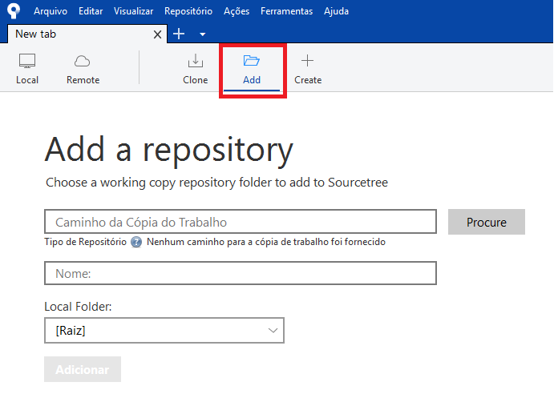

# Sourcetree para Windows

O Sourcetree é um software desenvolvido pela Atlassian que simplifica como você gerencia e interage com seus repositórios Git. Maiores informações em [Sourcetree](https://www.sourcetreeapp.com/).

## 1. Instalação
Realizar o download do Sourcetree no site [https://www.sourcetreeapp.com/](https://www.sourcetreeapp.com/), escolher a opção para Windows.

``` sh
Executar o arquivo .exe versão x.x.x baixado e seguir o wizard.
```

## 2. Configuração
### 2.1. Adicionando projeto .git

Se o projeto .git estiver clonado na máquina, basta adicionar o projeto ao Sourcetree.
Vá em Add no sourcetree: 



``` sh
Procure a pasta do projeto que deseja adicionar o projeto .git no Sourcetree.
```
Repare que quando selecionar a pasta do projeto na parte inferior da caixa de seleção deverá apresentar a mensagem, "Este é um repositório Git".
Dê um nome para o seu repositório no Souretree, esse nome será apresentado nas abas do Sourcetree e pode ser definido a critério do usuário para facilitar a gestão dos projetos, pois podem ser adicionados N projetos para serem gerenciados pelo Sourcetree.

### 2.2. Clonando projeto .git
Para projetos que estão no repositório Git da Digicade, basta ir em Clone:


``` sh
Procure a url do projeto no repositório Git da Digicade que deseja adicionar ao Sourcetree.
```

``` sh
Insira o caminho de destino que o projeto será clonado.
```
Dê um nome para o seu repositório no Souretree, esse nome será apresentado nas abas do Sourcetree e pode ser definido a critério do usuário para facilitar a gestão dos projetos, pois podem ser adicionados N projetos para serem gerenciados pelo Sourcetree.

## 3. Configurando o Gitflow

Após ter adicionado o projeto Git no Sourcetree vamos adotar os passos do Git Flow para gerenciamento de versões do projeto. Para isso basta acionar o botão Git Flow no Sourcetree:


Utilizar as configurações padrões que o Git Flow adota:


Após confirmar as configurações conforme a figura acima, será criado um branch develop e os comandos do Git Flow deverão ser usados conforme padrões do projeto.
